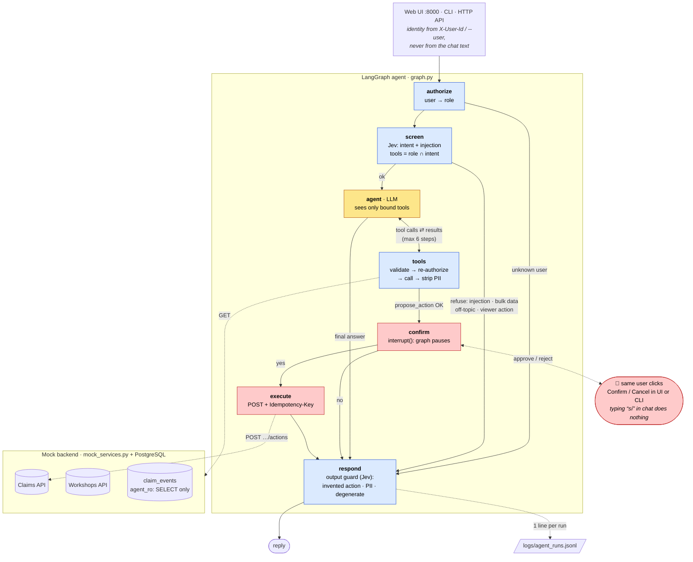

# OKORE · Claims Agent

A small agent that answers natural-language requests about a vehicle-repair claim (*expediente*), uses tools to
query APIs and a database, **never modifies a claim without explicit human confirmation**, handles failures
honestly and leaves a trace of every run.

Technical test for the AI / Agentic Automation Engineer role. Everything runs locally; all services and data are
simulated ([MOCK_DATA.md](MOCK_DATA.md)).

**The one-line design:** the LLM reasons and chooses read tools; code decides everything that has consequences —
identity, permissions, which tools the model may see, whether an action applies, its exact payload, the
confirmation, the execution and the retries.

```bash
cp .env.example .env
docker compose up -d --build          # postgres + mock APIs + web UI
# → http://localhost:8000   (pick a user, try the four cases from the sidebar)
```

With the defaults it needs no keys and no network: a scripted LLM and a rules-based judge stand in for the models.
[Run it with a real LLM](#real-llm) in two variables.

---

## Architecture



**Yellow** = the LLM decides · **blue** = deterministic code and guards · **red** = the only path that writes, gated
by a human. Dashed arrows = calls outside the graph.

| Module | Responsibility |
|---|---|
| `security.py` | Simulated users, roles, per-claim scope, which tools and actions each role may use |
| `tools.py` | The only way the agent touches the world: typed inputs, permission re-check, timeouts/retries, PII-free outputs, `propose_action` (decides) and `execute_action` (never offered to the LLM) |
| `judge.py` | Semantic judgments with **Jev** (TypeSafe System One): intent, injection, and output checks. `RulesJudge` (regex) without a key and as fallback |
| `graph.py` | The LangGraph state machine, routing policy, confirmation interrupt, step limit, trace writer |
| `llm.py` | `default_llm()` (scripted mock or any OpenAI-compatible server) and the versioned system prompt |
| `events_db.py` | One parameterized query over `claim_events`, as the read-only role |
| `trace.py` | Append-only JSONL trace |
| `api.py`, `static/index.html`, `cli.py` | HTTP API + single-file web UI (no build), terminal chat |
| `mock_services.py`, `db/init.sql` | Simulated claims/workshops/actions APIs, event history, DB roles and seed data |

### How the four cases flow

| Case | What happens |
|---|---|
| 1 · Query | `screen` sees a read intent → only read tools are bound → LLM calls `get_claim`, `get_claim_events` (and `get_workshop`) → answers from tool data. `propose_action` is not even offered. |
| 2 · Action | Intent `request_document` from an operator → `propose_action` checks the document is really missing, the workshop answers and is `ACTIVE`, and warns about a request in the last 7 days → the graph **pauses** with a templated question → the user confirms in the UI/CLI → one POST with an idempotency key. |
| 3 · Service failure | Tool retries transient errors (timeout/5xx) once; then the failure reaches the LLM as a typed error. The answer says what could not be obtained; an action is not proposed without a verified workshop; a failed POST is never reported as done. All errors land in the trace. |
| 4 · Malicious | Jev flags injection/bulk data → templated refusal before the LLM runs. Even if it got through: no tool lists claims, there is no free SQL, outputs have no customer PII and the DB role is read-only. |

## Technologies

| | Why |
|---|---|
| **Python 3.12**, **uv** | Required language; fast, locked, reproducible installs |
| **LangGraph** | Explicit state + `interrupt()` for human-in-the-loop + checkpointer: the confirmation is a real pause, not a prompt convention |
| **Pydantic** | Tool input validation (regex, enums, `extra="forbid"`) and output allowlists |
| **FastAPI** + **httpx** | Mock backend and the agent's API; one HTTP client with timeouts, injectable in tests (`TestClient` *is* an `httpx.Client`) |
| **PostgreSQL** + **psycopg** | Event history; least privilege enforced by the database itself |
| **Jev** (`typesafe-sdk`) | Fast typed judgments with probabilities (~300 ms) for routing and guardrails; thresholds live in code |
| **langchain-openai** `ChatOpenAI` | One adapter for any OpenAI-compatible server: **Ollama (`qwen2.5:14b`, local)**, vLLM, OpenAI |
| **Docker Compose**, **pytest** | One-command stack; 100 tests |

## Key technical decisions

**What the LLM decides vs. what code decides**

| LLM | Code (deterministic) |
|---|---|
| Understand the request, extract the claim id / document | Identity and role (outside the text) |
| Which read tools to call and in which order (e.g. whether the history is needed) | Which tools are bound: role ∩ intent. Doubtful intent → read-only |
| Draft the final answer from tool data | Argument validation, per-claim scope, PII projection |
| | Whether the document is missing, which action applies, its payload, the confirmation text |
| | Execution, idempotency, retries, step limit (6), thresholds on Jev's probabilities |

- **A tool-calling agent, not a fixed pipeline** — the model genuinely plans its reads, and safety does not depend on
  it: no tool it sees can write.
- **`propose_action` is the decision; execution is not a tool.** It returns a `PendingAction` (uuid, exact payload,
  10-minute TTL, warnings, templated confirmation text). `execute_action` is only reachable by resuming the graph.
- **The confirmation is structural.** `interrupt()` pauses the graph; only `confirm(thread, user, approve)` from the
  UI/CLI resumes it, and only for the user who asked. Typing "sí, confirmo" in the chat is just another message: a
  new turn discards the pending proposal.
- **Idempotency key = pending action id.** Retries of the same approval never duplicate; a legitimate new request
  next week gets a new key. Business duplicates are caught separately from the history (7-day window warning).
- **Two barriers for tools.** The model is only offered allowed tools; every tool re-checks permission and scope, and
  the `tools` node rejects any call to a tool that was not bound (tested with a deliberately "rogue" LLM).
- **Least privilege in the database, not only in Python.** `agent_ro` can only `SELECT` one table, with a read-only
  default transaction and a 2 s statement timeout; the mock backend writes with `backend_rw` (insert, no delete).
- **PII never leaves the tool layer.** Tool outputs are Pydantic models with an allowlist of fields; the mock
  backend returns customer data on purpose and tests assert it never reaches answers or traces.
- **Jev for judgments, code for policy.** One Jev call per turn classifies intent (`Choice`) and injection (`Noul`);
  another checks the answer (invented action, customer PII, degenerate/off-domain output). What each probability
  triggers is explicit code in `graph._route` / `respond`. Without a key — or if Jev fails — a regex judge takes over
  and the fallback is logged. Judgments only ever *narrow* what the agent may do.
- **Mock LLM for determinism.** `ScriptedLLM` plays the model by rules, so tests are fast and stable and the stack
  runs with no keys. Live tests against the real model and Jev run when they are available.
- **No RAG.** The data is structured and fetched by id; nothing here benefits from retrieval. It would fit later for
  internal procedures or free-text notes.

## Answers to section 11

**LLM responsibilities.** Interpreting the request, choosing and sequencing read tools, and writing the answer from
their results. It does not decide identity, permissions, whether an action applies or its parameters, and it
cannot execute anything: it has no write tool.

**Controls that never depend only on the LLM.** Authentication/role resolution; tool binding per role and intent;
input validation; per-claim scope; the output field allowlist; the preconditions of an action; the confirmation;
execution and idempotency; retries and timeouts; the step limit; database privileges. The system prompt is the only
"soft" layer, and nothing relies on it for safety.

**Actions: accidental, twice, wrong parameters, no permission.**
*Accidental:* only a structured resume from the same user executes; the text is a template of the exact payload.
*Twice:* the pending action is consumed after the first confirmation (a second one is a no-op) and the POST carries
`Idempotency-Key`, so a retry after a lost response returns the original result; recent duplicates are flagged
before proposing. *Wrong parameters:* the payload is built by code from validated enums and the claim's own data;
at execution it must still be the same user, role, scope and within the TTL, and the backend refuses a document that
is no longer missing (409). *No permission:* the tool is not bound for the
role, `propose_action` re-checks, and `execute_action` re-checks user, role and scope at execution time.

**If an API or the DB does not respond.** 2 s timeout, one retry with backoff for timeouts/connection errors/5xx
(4xx are answers, not retried). The agent answers with what it has, states what failed and why, and never fills
gaps. No proposal without a verified workshop. A write that fails after retries is reported as *uncertain* ("check
the history before asking again"). An identical failed call is not repeated within the turn. A down LLM or Jev
degrades to a templated answer or to the rules judge — always recorded in the trace.

**For thousands of operations a day.** See [production](#what-id-add-for-production).

## How to run

Prerequisites: Docker, and [uv](https://docs.astral.sh/uv/) for running locally or testing.

**Web UI** — `docker compose up -d --build` → <http://localhost:8000>. Pick a user on the left (the identity is
the selection, not the chat), use the example requests, confirm or cancel actions in the card below the answer.

| User | Role | Sees | Can request documents |
|---|---|---|---|
| `ana` | viewer | EXP-10234, EXP-10235 | no |
| `luis` | operator | every claim | yes |
| `marta` | operator | claims of workshops T-412, T-517, T-633 | yes |

**CLI** — `docker compose run --rm agent --user luis` (interactive) or add a message to ask once:
`docker compose run --rm agent --user ana "¿En qué estado está EXP-10234?"`.

**HTTP API** — `POST /api/chat {message, thread_id?}` and `POST /api/chat/confirm {thread_id, approve}` with header
`X-User-Id`; OpenAPI at `/docs`.

<a id="real-llm"></a>**Real LLM** — any OpenAI-compatible server. With Ollama on the host:

```bash
ollama pull qwen2.5:14b                                   # tool calling, good Spanish, ~9 GB (16 GB GPU)
# .env
LLM_PROVIDER=openai_compat
LLM_MODEL=qwen2.5:14b          # LLM_BASE_URL defaults to Ollama; containers reach it via host.docker.internal
```

For OpenAI or another hosted model, set `LLM_BASE_URL`/`DOCKER_LLM_BASE_URL`, `LLM_MODEL` and `LLM_API_KEY`.
Swapping external ↔ local model is only configuration.

**Jev** — set `TYPESAFE_API_KEY` in `.env`. Without it the rules judge is used.

**Case 3 (service failure)** — `FAULT_WORKSHOPS=500 docker compose up -d mocks` (or `timeout`); restore with
`docker compose up -d mocks`. When using the CLI meanwhile, add `--no-deps` so `run` does not recreate the mocks.

**Without Docker for the app** — keep `docker compose up -d postgres mocks`, then
`uv sync` and `uv run --env-file .env uvicorn okore_agent.api:app --port 8000` (or `python -m okore_agent.cli --user luis`).

**Tests**

```bash
uv run pytest                      # 77 tests, no network: scripted LLM, rules judge, in-process mocks
uv run --env-file .env pytest      # + 23 live tests against Jev and the real LLM when configured (100 total)
```

The four cases, permissions, the rogue-LLM barriers, retries, the lost-response scenario, idempotency, PII and the
trace all have tests (`tests/test_graph.py`, `test_tools.py`, `test_errors_trace.py`, `test_api.py`).

## Traceability

Every `ask` and every `confirm` appends one line to `logs/agent_runs.jsonl` — also when the run crashes, is refused
or there was nothing to confirm. It has the fields requested in the brief plus what is needed to explain a decision:
role, judge probabilities and source, bound tools, model and prompt version, per-tool latency and full (PII-free)
results, and the link between the proposal and its execution (`request_id`, `pending_action_id`,
`idempotency_key`). Real line from a run (tool data elided):

```json
{"request_id": "877775bd-…", "timestamp": "2026-09-30T15:44:05.566+00:00", "kind": "ask", "user_id": "luis",
 "role": "operator", "user_request": "pide el documento al taller", "detected_intent": "request_document",
 "intent_confidence": 0.95, "injection": 0.06, "judge_source": "jev-1.13.0", "suspicious": false, "route": "agent",
 "tools_enabled": ["get_claim", "get_claim_events", "get_workshop", "propose_action"], "llm_model": "qwen2.5:14b",
 "prompt_version": "system-v3", "llm_steps": 1, "tools_called": ["propose_action"],
 "tool_parameters": [{"claim_id": "EXP-10234", "document": "PHOTO_PLATE"}],
 "tool_results": [{"ok": true, "error": null, "latency_ms": 12, "data": "…"}],
 "final_decision": "awaiting_confirmation", "answer": "He comprobado que falta la fotografía de matrícula en el expediente EXP-10234. Se va a solicitar al taller T-228 (Talleres Norte Madrid). ¿Confirmas que ejecute la acción?",
 "action_requested": {"pending_action_id": "32181620-…", "claim_id": "EXP-10234", "action": "REQUEST_DOCUMENT",
 "document": "PHOTO_PLATE", "workshop_id": "T-228", "expires_at": "2026-09-30T15:54:05"},
 "pending_action_id": "32181620-…", "idempotency_key": null, "action_executed": false, "errors": [],
 "latency_ms": 1847}
```

The confirm line that follows shares `request_id`, lists `execute_action`, and sets `idempotency_key` and
`action_executed`.

## Known limitations

- **No authentication.** The user id is trusted as given (`X-User-Id`, `--user`); threads are bound to it, but anyone
  can claim any id. In production it comes from a validated token (OIDC) at a gateway.
- **In-memory state.** Checkpoints, pending actions, thread ownership and the mock's idempotency store live in one
  process and are lost on restart; a single instance only.
- **Model quality** (`qwen2.5:14b`, 14B local). Seen and handled: guessed arguments in batched calls (stopped by
  validation), a claimed-but-not-executed action (output guard), a degenerate answer in Thai (output guard), a
  mistranslated document code (glossary in the prompt). Still possible: a vague answer after its own invalid
  arguments, and follow-ups answered from earlier turns instead of re-querying. Never invented data or an unconfirmed
  write in testing.
- **Jev thresholds** are set on a few dozen phrases, not calibrated on real traffic; its questions are in English over
  Spanish text (works in tests).
- **Rules fallback** is keyword-based (Spanish only, no paraphrases). It only has to be safe: anything unmatched
  becomes a read-only agent.
- **Indirect prompt injection** via backend data (event descriptions) is mitigated only by instruction and by the
  fact that no tool can write or list; content is not sanitized.
- **Duplicate detection** matches the document code in the event description; a `document` column would be sturdier.
- DB passwords are in `init.sql`; no rate limiting; the trace is a local file.

## What I'd add for production

*For thousands of operations a day:*

- **Identity & access:** OIDC tokens validated at an API gateway; roles/scopes from the IdP; per-user rate limits.
- **Durable state:** Postgres/Redis checkpointer and pending actions; thread ownership in the same store; stateless,
  horizontally scaled agent workers.
- **Reliable actions:** an outbox table written in the same transaction as the pending action, a worker that executes
  it with the idempotency key, persisted keys (unique constraint) in the backend, and a status lookup before any retry
  so a lost response is resolved by asking, not by resending.
- **Resilience:** circuit breakers and bulkheads per dependency, timeouts budgeted per request, async/queued handling
  for slow backends (e.g. a 15 s API answers "in progress" and notifies later), cached reads with short TTLs.
- **Observability:** OpenTelemetry traces per node and tool, metrics (latency, error rate, refusals, withheld answers,
  confirmation rate), logs shipped to a central store with retention and PII policy; LangGraph checkpoints as the
  replay of *why* a decision was taken.
- **Model operations:** an evaluation set built from real (anonymized) traffic run on every prompt/model change,
  calibrated Jev thresholds per route, prompt and model versions in every trace (already there), gradual rollouts,
  and a fallback model.
- **Security:** secrets in a manager, network policies, sanitizing backend free text before it reaches the model,
  periodic red-teaming of the injection guard.
- **Data:** RAG over internal procedures if the agent has to explain *how* to proceed, not just the claim state.

## Scenarios from the review session

| Scenario | Where it is handled / how it would evolve |
|---|---|
| The API takes 15 s | 2 s timeout + one retry → honest "could not obtain"; for real: async job + notify, or a circuit breaker |
| User can read a claim but not modify it | `viewer` role: `propose_action` never bound, re-checked in the tool and at execution |
| Action executed but the response is lost | Same idempotency key on retry returns the original result (tested); if still unknown, the answer says so and the next proposal warns about the duplicate |
| Avoid running the same action twice | Consumed pending state + idempotency key + 7-day duplicate warning |
| Replace the external LLM with a local one | `LLM_BASE_URL` + `LLM_MODEL` (this repo already runs on a local model) |
| Explain why the agent decided something | The trace line: intent and its probability, injection score, bound tools, every tool call with arguments and results, prompt/model version, output judgment |

## Use of AI assistants

- Claude Code
- Gemini

